# Reanalysis of Cocaine-Induced Transcriptional Changes in SST Interneurons of the Nucleus Accumbens Using recount3 and limma-voom

## Introduction

Cocaine exposure induces rapid molecular and cellular changes in brain regions involved in reward processing. The nucleus accumbens (NAc) is a central component of the mesolimbic dopaminergic pathway and plays a major role in reinforcement and addiction-related behaviors.

The original study (Nature Communications, 2018; DOI: s41467-018-05657-9) investigated transcriptional responses to acute cocaine administration in specific neuronal subpopulations of the NAc. In particular, the authors focused on somatostatin-expressing (SST) interneurons and reported activation of immediate-early genes and transcriptional programs associated with synaptic plasticity one hour after cocaine exposure.

The goal of this work was to reanalyze the RNA-seq dataset (SRP151726) using a standardized workflow based on recount3 and limma-voom, in order to evaluate whether the reported transcriptional changes can be reproduced under a conventional differential expression framework.

## Data Origin

- Study accession: SRP151726
- Organism: Mus musculus
- Tissue: Nucleus accumbens
- Cell type: SST interneurons
- Conditions:
    Saline (control)
    Cocaine (1 hour post-injection)
- Sample size: 20 total (10 per group)

Gene-level counts were obtained through recount3, converted to a RangedSummarizedExperiment object and processed for downstream analysis.

## Methods Overview

1. Gene filtering based on minimum expression.
2. Library size normalization.
3. Mean-variance modeling using voom.
4. Linear modeling: ~ group
5. Contrast: cocaine vs saline.
6. Multiple testing correction using Benjamini–Hochberg FDR.

## Results

### Quality Control

**Global Expression Distributions**
The logCPM density distributions were nearly identical between saline and cocaine samples. This indicates the absence of global systematic biases in sequencing depth or normalization.

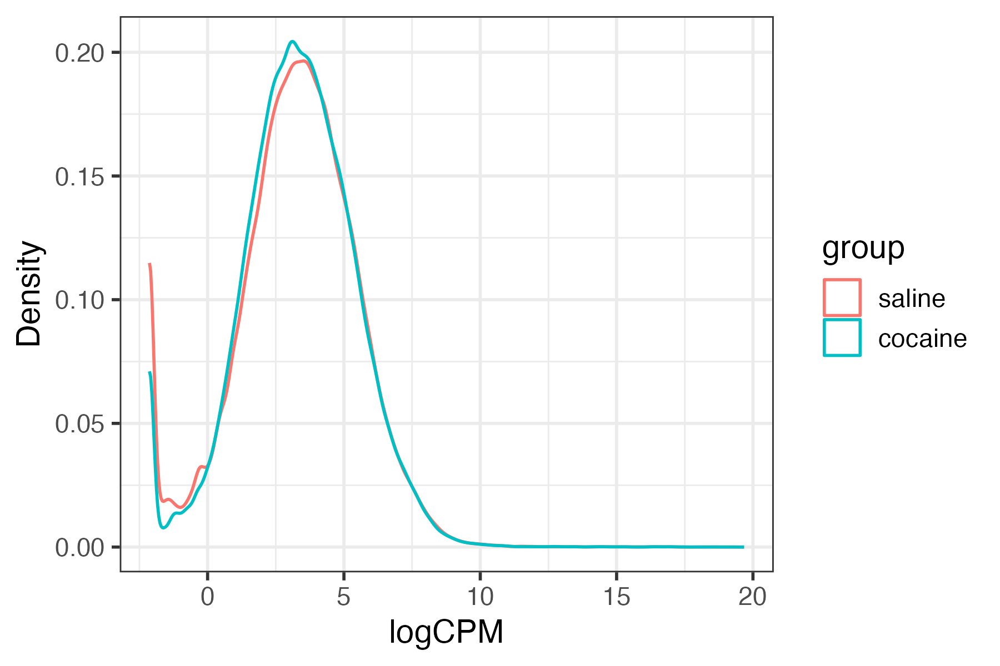

**Library Size**

Log-transformed library sizes were comparable across groups, suggesting balanced sequencing depth and no imbalance between condition. 

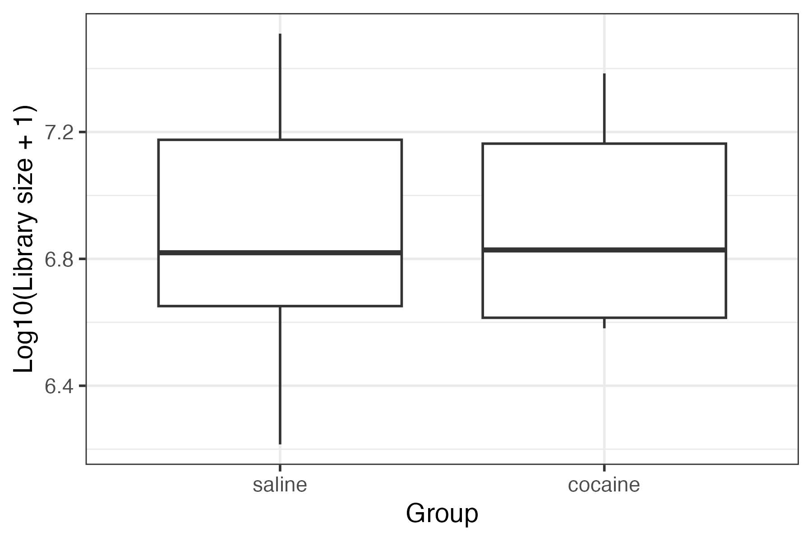

**Assigned Gene Proportion**
The fraction of reads assigned to annotated genes was similar between conditions, indicating homogeneous sequencing quality.

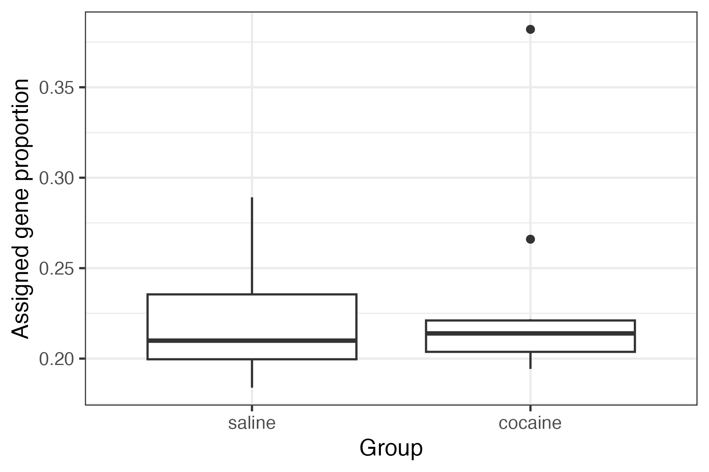

**Sample-to-Sample Correlation**

The correlation heatmap showed high overall similarity between samples (correlation values approximately 0.6–1). Importantly, clustering did not separate samples according to treatment condition, suggesting that treatment is not the main source of transcriptomic variation.

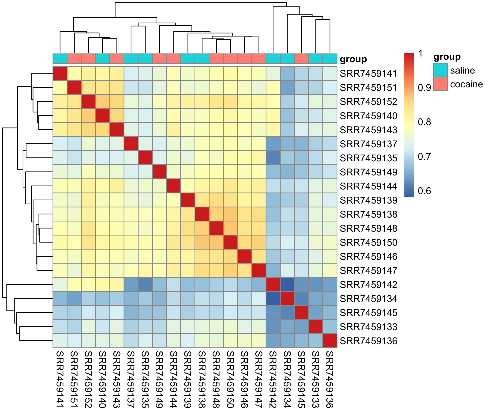

**Interpretation**

At the global transcriptome level, cocaine-treated samples are highly similar to controls.

### voom Mean–Variance Modeling

The voom mean–variance trend displayed the expected inverse relationship between expression level and variance. Low-expression genes showed higher variability, which stabilized at higher expression levels.

This confirms appropriate modeling of heteroscedasticity and supports the validity of downstream linear modeling.

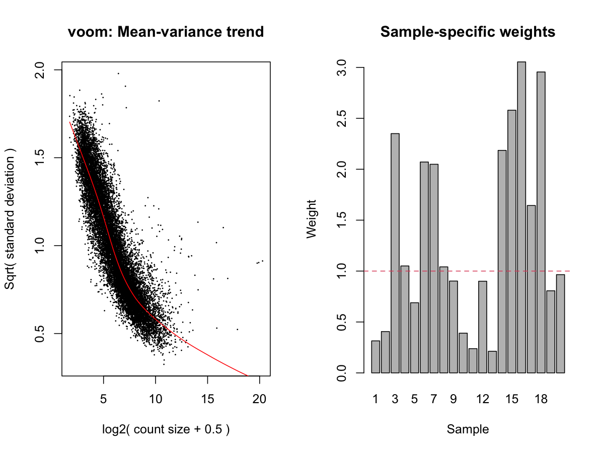 

### Exploratory Multivariate Analysis

**PCA**

Principal component analysis showed:

- PC1 explains 17.6% of variance.
- PC2 explains 11.9% of variance.

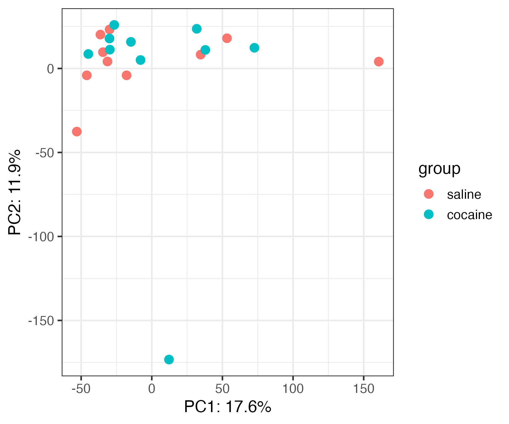

No clear separation between saline and cocaine samples was observed along either principal component.

**MDS**
Multidimensional scaling showed similar results, samples from both groups overlapped significantly with no distinct clustering by treatment.

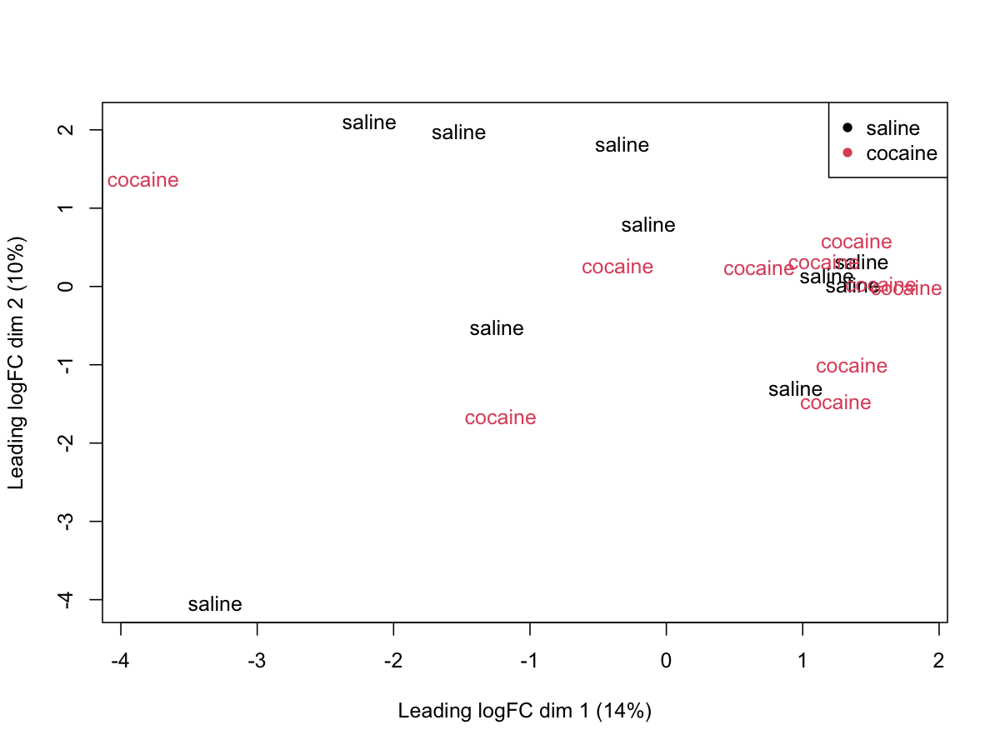

**Interpretation**

The largest sources of transcriptional variation are not associated with treatment, it seems that biological variability within groups is comparable to variability between groups. This suggests that if treatment effects exist, they are subtle compared to overall transcriptomic variation.

### Differential Expression Analysis

**P-value Distribution**

The histogram of raw p-values was approximately uniform, this suggests absence of widespread systematic differential expression. If strong treatment effects were present, an enrichment of very small p-values would be expected.

**Nominally Significant Genes**

- 84 genes with p < 0.01
- 5 genes with p < 0.001
- 0 genes with FDR < 0.05
- Minimum FDR ≈ 0.9984

Considering that approximately 15,575 genes were tested, under the null hypothesis around 156 genes with p < 0.01 would be expected by chance alone. Observing only 84 genes below this threshold supports the idea that there is no strong global signal.

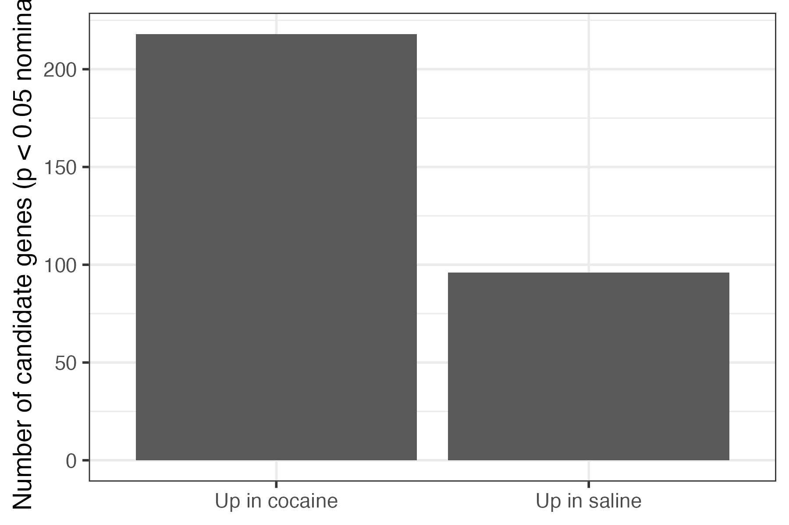

**MA Plot**

The MA plot shows log-fold changes centered around zero across the full range of average expression, there is no systematic upward or downward shift in expression between groups.

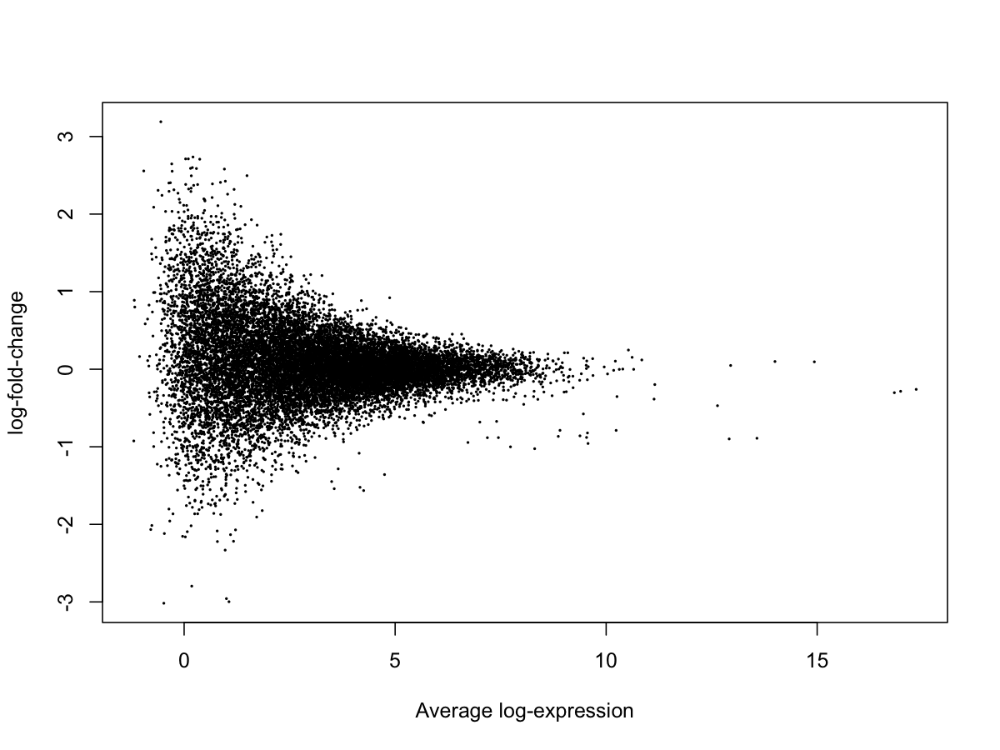

**Volcano Plot**

The volcano plot confirms that no genes surpass the FDR significance threshold; while some genes display moderate log2 fold changes, their p-values are not sufficiently low after correction.

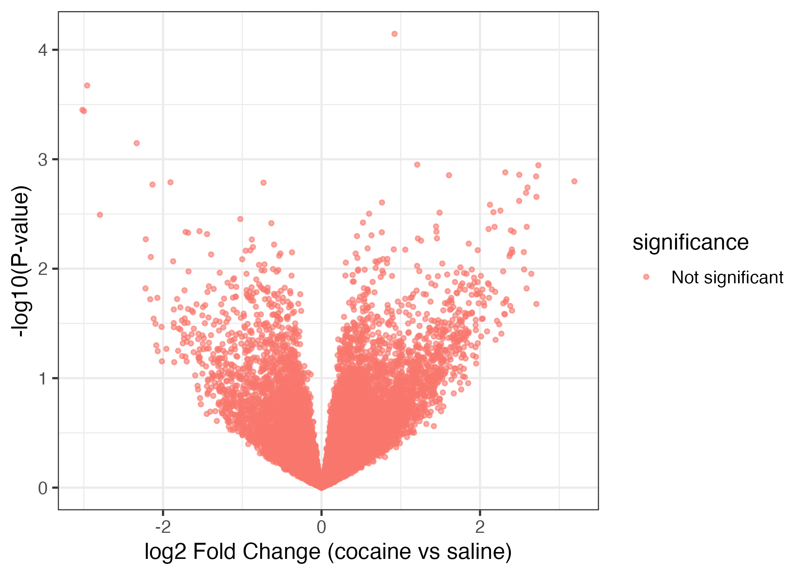

**Heatmap of Top 50 Nominal Genes**

Even among the most nominally significant genes, samples do not cluster cleanly by treatment; expression patterns show variability, but no consistent treatment-driven separation.

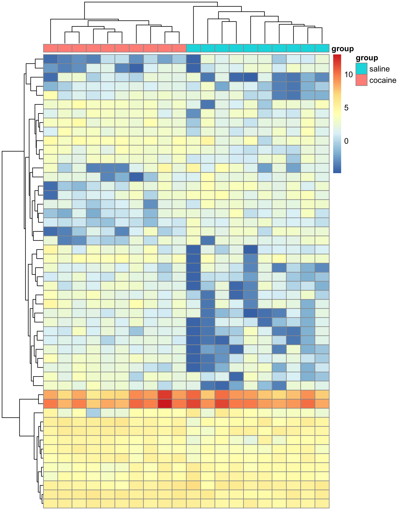

## Biological Interpretation 

The results obtained in the original study described a rapid transcriptional response in SST interneurons one hour after cocaine administration, highlighting activation of immediate early genes and pathways related to synaptic plasticity. In this reanalysis, however, there was no detection of  statistically significant genes after correcting for multiple testing, the exploratory analyses (PCA and MDS) did not show a clear separation between saline and cocaine samples and, at a global level, the transcriptomes of both groups appear very similar.

There are several possible reasons for this difference; first, the biological effect at one hour may be subtle rather than large-scale, as mentioned in the article, cocaine can trigger rapid signaling cascades, but those early responses may involve only a small number of genes or modest changes in expression that are difficult to detect with standard differential expression models.

Second, results can be sensitive to analytical choices, differences in filtering thresholds, normalization strategies, covariate adjustment, or statistical modeling may influence which genes reach significance. It is also possible that variability within the SST interneuron population masks treatment-specific changes; even though these cells share a marker (SST), they may not respond uniformly to cocaine.

Lastly, acute exposure at a single time point may not capture the full transcriptional dynamics of cocaine response, repeated exposure or time-course experiments could reveal stronger or more consistent patterns.

I think it is important to mention that the absence of statistically significant genes does not mean that cocaine has no biological effect, rather, under a conservative limma-voom framework with multiple testing correction, if  any transcriptional effects are present, they are modest in magnitude at the genome-wide level.

## Conclusion

In this independent reanalysis of SRP151726 using recount3 and limma-voom, no genes remained significant after false discovery rate correction. Multiple lines of evidence—including global expression distributions, PCA, MDS, MA plots and volcano plots, suggest that acute cocaine exposure (1 hour post-injection) does not produce strong, transcriptome-wide shifts in SST interneurons under this analytical framework.

These results demostrate how conclusions in transcriptomics can depend on statistical modeling choices, even when biological effects are expected, it is essential to evaluate their magnitude carefully and interpret statistical results taking into consideration the general experimental context.

### Reference

1. Ribeiro, E.A., Salery, M., Scarpa, J.R. et al. Transcriptional and physiological adaptations in nucleus accumbens somatostatin interneurons that regulate behavioral responses to cocaine. Nat Commun 9, 3149 (2018). https://doi.org/10.1038/s41467-018-05657-9